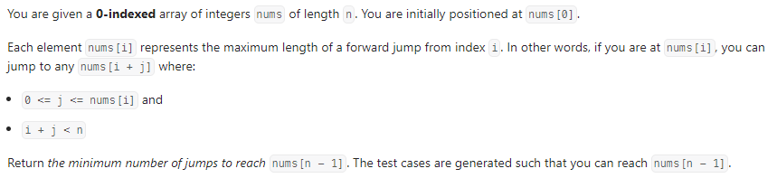
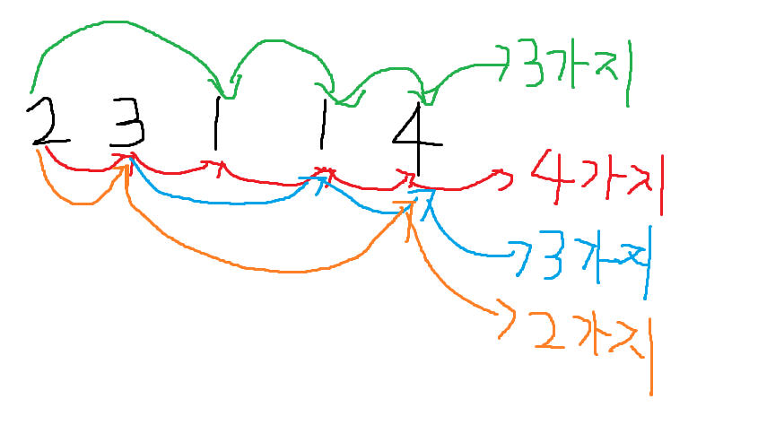
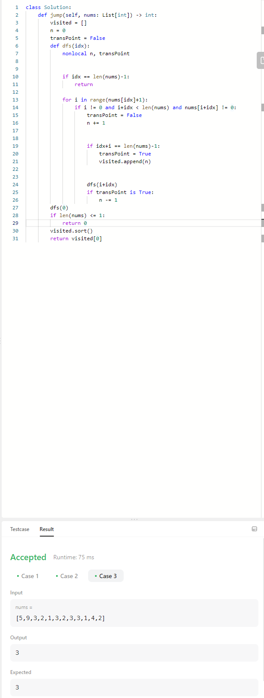
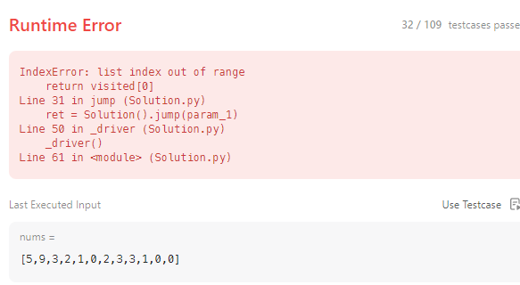
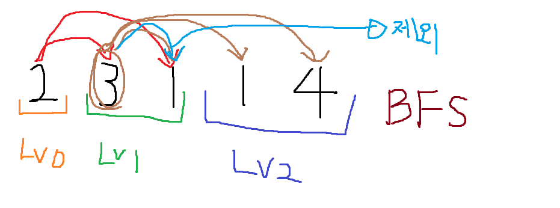
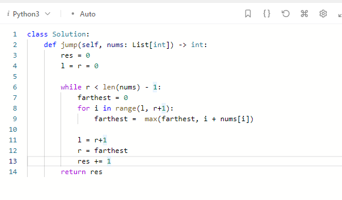

# # 🔥 Jump Game2 - 알고리즘 문제(Leet Code)

-  
- <a href="https://leetcode.com/problems/jump-game-ii/description/" target="blank">Valid Sudoku 문제</a>

1. 문제 이해하기
2. 문제 접근하기
3. 문제 코드 작성하기
4. 실행하기   

## 1. 문제 이해하기

<section style="margin:40px 0">
   
   
  주어진 양의 정수 배열이 있고, 인덱스 0번부터 시작해야한다. 
  그리고 각 인덱스의 값들은 최대 점프를 의미 한다. 
  ex) &nbsp;&nbsp; num[0] = 2 &nbsp;&nbsp; -->  &nbsp;&nbsp; 0<= j <=2 
  ex) &nbsp;&nbsp; 0 + 1, 0 + 2  --> num[1] or num[2] (0+0은 제외) 
  마지막 인덱스에 도달할 수 있는 <strong>*점프의 최소수*</strong> 를 반환하는 문제이다.
</section>

## 2. 문제 접근하기 > 문제 코드 작성하기 > 실행하기  

- ## 1. DFS로 생각하기

   

  마지막 인덱스에 도착하고 나서 return 하기전 간만큼 빼줘서 돌아오고 
  다시 반복문을 타서 마지막 인덱스에 도착하는 방식으로 해봤다... 
  그결과...

   

  테스트 케이스는 성공했지만, 아뿔싸... 
  0이 있을때를 생각을 하다가 말았다.. 
  그래서 코드에 num[i+idx] != 0 이걸 마지막에는
  제외 해야한다는것을...

   

  이왕 이렇게 된거 자세히 공부하면서 배운다는 마인드로, 
  다른분들은 어떻게 풀었는지 보면서 그방식대로 푸는게 도움이 될꺼라고 생각했다.

  -<a href="https://www.youtube.com/watch?v=dJ7sWiOoK7g" target="blank">해당 문제풀이</a>

   
  어떤 사람은 DP로 풀고, 어떤 사람은 Greedy로 풀고, BFS로 풀고 해서 
  BFS 위주로 한번 찾아서 보았다

   

  확실히 BFS로 풀면서 left, right를 주고 가장먼것을 farthest라고 주면서
  level by level 하는게 확실히 더 간결하고 이해가 잘됬다...

  ## 3. 되돌아보기

  왜 DFS로 풀어서 할려고 생각을 했을까? 
  내자신한테 의문을 많이 가졌다 그당시에는 
  BFS로 생각했지만 DFS로 먼저 풀어본다는 마인드이면서 
  문제를 심화하게 생각안하고(0이 중간에 있을때 or 마지막이 0일때) 풀어서 
  Runtime Error가 발생했다... 
  다시 풀어보고 또 다시 풀어봐야겠다.. 최소 5번..😤 
